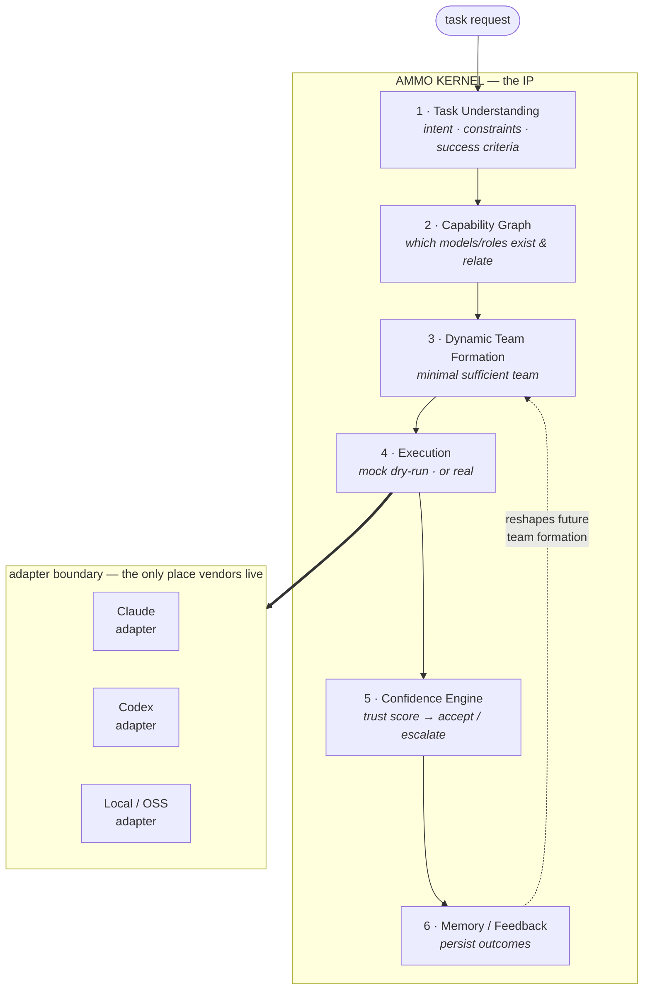

# AMMO

**AMMO is not a router. AMMO is the adaptive orchestration kernel of a Personal AI OS.**

AMMO (**A**daptive **M**ulti-**M**odel **O**rchestrator) is not a program that
calls a model. It is a learning kernel that treats every model — Claude, Codex,
local/OSS — as a replaceable plugin, and keeps the durable intelligence for
itself:

1. **Understands** the task,
2. **Forms** a temporary AI team to solve it,
3. **Executes** it (mock or real) through model adapters,
4. **Scores** the confidence of the result, and
5. **Remembers** what worked and what failed — so the *next* team is formed
   differently.

> **Models are plugins. AMMO is the IP.**

---

## Purpose — why AMMO exists

A router maps one request to one endpoint and stops. It cannot learn, cannot
compose, cannot tell you how much to trust its answer.

AMMO inverts that. The value does not live in any single model — models come
and go, prices change, a better one ships every month. The value lives in the
**kernel**: its ability to understand a task, assemble the *minimal sufficient*
team of capabilities for it, judge the confidence of the outcome, and fold that
outcome back into memory so future decisions improve. Any model can be swapped
out without touching this intelligence, because everything vendor-specific is
confined behind a single adapter contract.

The result is a Personal AI OS kernel: it **schedules** capabilities, **isolates**
itself from the data it governs, and **mediates** every model call — the same
way an operating-system kernel schedules, isolates, and mediates applications.

## System overview



Nothing above the adapter boundary knows what a "Claude" or a "Codex" is. The
kernel speaks one stable adapter contract; adapters translate it to concrete
providers (authenticated subscription CLIs, paid API/HTTP, or a local model
pool). That is what makes *"models are plugins"* enforceable rather than
aspirational.

### The kernel loop, in one line

```
structure → register → analyze → form team → execute → confidence → memory → learn
```

## Install — one-time setup

Clone the repo and create its virtualenv **once**. Every command below is run
from the **repo root** (`cd` into it first).

```bash
git clone https://github.com/lufelufe/ammo.git
cd ammo
python3 -m venv .venv && .venv/bin/pip install -e '.[dev]'   # one-time
```

The `./ammo` launcher uses that `.venv` automatically — you never need to
activate it. (If you skip the setup, `./ammo` prints the exact command to run.)

## Controls — how to operate AMMO

### Summon — where to run it

AMMO is summoned differently depending on where you are:

| You are in… | Summon with | Runs from |
|---|---|---|
| **A terminal** | `./ammo start` | the **repo root** (the folder you cloned) |
| **Claude Code** | just say **`ammo`** | any dir — `CLAUDE.md` carries the summon line (`--host claude-code`) |
| **Codex** | just say **`ammo`** | reads `AGENTS.md` natively → its *Summon* section |
| **Qwen / Gemini** | just say **`ammo`** | pointer files `QWEN.md` / `GEMINI.md` → `AGENTS.md` |

Inside an agent host, the one word **`ammo`** is enough — the host's
instruction file (`CLAUDE.md` / `AGENTS.md` / …) runs the summon for you. In a
bare terminal, use the `./ammo` launcher from the repo root. The first summon
runs a short setup wizard; every later one prints a one-screen ready summary.

```bash
./ammo start          # summon: first-run wizard, or the ready summary if configured
./ammo status         # one screen: host, models, systems, memory
```

### Interactive shell (recommended)

`ammo enter` opens a stay-inside session: type a request and it runs, or type a
subcommand. Configure once with `set`, and every later request inherits it.

```bash
./ammo enter
> set real                 # mock (default) or real execution
> set optimize speed       # balanced | performance | cost | speed
> set read ./src           # grant read access to a path
> fix the failing test in utils and add a regression test
> status
> feedback <run-id> good   # judge a run — this is the learning signal
> exit
```

### One-shot commands

Run a full request through the kernel loop:

```bash
./ammo run --mock "fix the bug in this repo and add tests"   # dry-run, spends nothing
./ammo run --real "..."                                       # calls authenticated CLIs
./ammo show-run <run-id>                                      # inspect a stored run
./ammo feedback <run-id> good|bad                             # ground truth for learning
```

### The command surface, by stage

| Stage | Commands |
|---|---|
| **Understand** | `analyze` — request → TaskVector (rule-based, no model call) |
| **Capability graph** | `list-models`, `score-models` — score models against a request |
| **Team** | `plan-team` — form a team (ExecutionPlan) without executing |
| **Execute** | `run`, `show-run`, `promote` (apply a run's sandboxed writes after a diff) |
| **Confidence** | surfaced in every `run`; `calibrate` compares scores vs. feedback |
| **Memory / learn** | `memory`, `feedback`, `dream` (consolidate memory), `efficiency` (quality-per-cost) |
| **Systems** | `list-systems`, `inspect-system`, `new-system`, `connect`, `disconnect`, `adopt`, `eval-system(s)` |
| **Providers / models** | `providers` (detect CLIs/API/local), `bind`, `pricing` |
| **Health** | `doctor`, `eval` (score AMMO's decisions), `role-log` |

Full help: `./ammo --help` (or `./ammo <command> --help`).

## Repository layout

```
ammo/
├── README.md
├── AGENTS.md                 # Working guide + constitution copy (auto-loaded by agents)
├── ammo                      # Terminal launcher (no venv activation needed)
├── ammo.config.yaml          # Machine-local summon config (host, models, objective) — no secrets
├── pyproject.toml
├── docs/                     # Architecture, manifesto, roadmap, backlog, playbooks
├── src/ammo/                 # Implementation code (the kernel)
│   ├── kernel/               #   task_understanding / capability_graph / team_formation
│   │                         #   executor / confidence / evaluation
│   ├── adapters/             #   model adapter contract + mock/command/http adapters
│   ├── providers/            #   provider availability (subscription CLI / API / local)
│   ├── economics/            #   token usage + cost estimation
│   ├── memory/               #   run memory + memory-guided advisor
│   ├── dream/                #   memory consolidation
│   ├── binding/ connect/ evalsuite/ commands/
│   └── cli.py                #   command surface (see `./ammo --help`)
├── tests/                    # Test suite
├── evals/                    # Eval-suite cases (per-domain)
├── systems/                  # System packs (domain capabilities)
├── registry/                 # Registries: systems / models / tools / roles / pricing
├── memory/                   # Learning memory (feedback loop)  [contents gitignored]
├── runtime/                  # Runs, reports, sandboxes          [contents gitignored]
└── vaults/                   # Private data vaults               [contents gitignored]
```

`src/ammo/` holds **code**; `systems/ registry/ memory/ runtime/ vaults/` hold
**data**. This separation is deliberate and load-bearing: the kernel must never
be entangled with the data it governs.

## Development

After the one-time [install](#install--one-time-setup), from the repo root:

```bash
source .venv/bin/activate       # or just prefix commands with .venv/bin/
python -m ammo doctor           # check the AMMO root structure
python -m ammo run --mock "fix the bug in this repo and add tests"
pytest
```

## Status

The kernel loop — understand → team → execute → confidence → memory → learn —
is implemented end-to-end, including **real** execution via authenticated CLIs
(multi-model), measured consensus (N-way lead sampling), grounded workers (read
real files before answering), measured latency, and an interactive shell.
Current state and history: [`docs/ROADMAP.md`](docs/ROADMAP.md); deferred items:
[`docs/BACKLOG.md`](docs/BACKLOG.md).

## Constitution (hard rules)

Canonical copy: [`docs/AMMO_MANIFESTO.md`](docs/AMMO_MANIFESTO.md) §5 (working
copy for agents in [`AGENTS.md`](AGENTS.md)). Headline: **models are plugins,
AMMO is the IP** — no secrets in the repo, adapters own all vendor specifics,
small tested modules, never destructively move user data.

## Further reading

- [`docs/AMMO_MANIFESTO.md`](docs/AMMO_MANIFESTO.md) — the constitution & philosophy
- [`docs/AMMO_ARCHITECTURE.md`](docs/AMMO_ARCHITECTURE.md) — architecture in depth
- [`docs/MODEL_ADAPTER_SPEC.md`](docs/MODEL_ADAPTER_SPEC.md) — the adapter contract
- [`docs/SYSTEM_PACK_SPEC.md`](docs/SYSTEM_PACK_SPEC.md) — how system packs extend the kernel
- [`docs/SUMMON.md`](docs/SUMMON.md) — the summon protocol
- [`docs/ROADMAP.md`](docs/ROADMAP.md) · [`docs/BACKLOG.md`](docs/BACKLOG.md)
```
